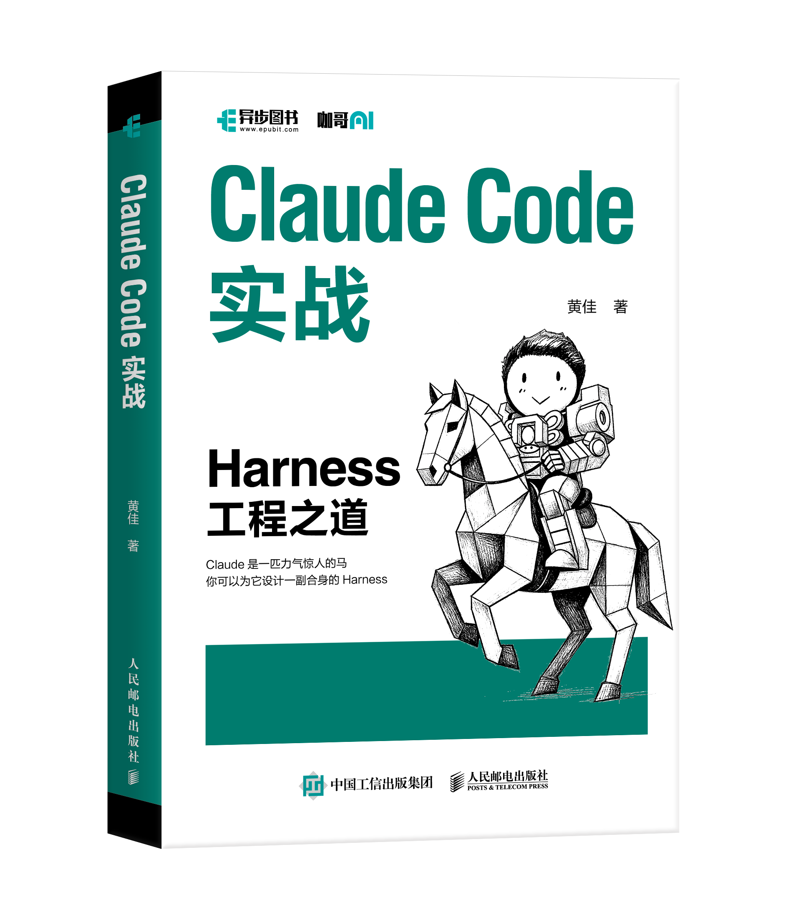

# Claude Code 工程化实战 · 课程大纲

---

## 📕 新书[《Claude Code 实战》](https://item.jd.com/15374814.html)正式发布

 

  
  

**这本书和极客时间的课程不是同一份内容，而是互补的两条腿。**

|  | 📕 [《Claude Code 实战》（书）](https://item.jd.com/15374814.html) | 🎯 Claude Code 工程化实战（极客时间课程） |
|---|---|---|
| **形态** | 10 章纸质书 | 23 讲音频专栏 + 音频（还有一些前沿加餐视频内容） |
| **节奏** | 体系化阅读，章节之间环环相扣 | 一讲一个主题，独立可拆，碎片时间消化 |
| **取舍** | 把整个 Claude Code 的技术全景**讲透讲深**，重原理与心法 | 在书的基础上**加项目、加更新、加深度案例**——（很多朋友说课程讨论区是高价值精华！） |
| **代码** | 章节配套代码片段（[`99-书籍代码/`](99-书籍代码/)，226 个片段） | 每讲一个 `projects/` 子目录，可直接跑 |
| **适合谁** | 想用一本书系统建立 Claude Code 完整心智模型 | 想跟着真实项目一步步做，把每个机制吃透 |

**配合阅读：**

> 📕 **先读书**，建立 10 章的完整骨架（记忆 / Skills / SubAgent / Hooks / MCP / Headless / SDK / Plugins）→ 🎯 **再跟课程**，每个机制用 2-3 讲深挖项目细节、踩坑现场和最新更新。
>
> 一本书一门课，正好把 Claude Code 的"骨"和"肉"补全。

📕 **欢迎大家翻翻[这本新书](https://item.jd.com/15374814.html)** —— 不管是刚接触 Claude Code 想找一本权威入门，还是已经在用想把整套工程化方法论补齐，这本书都能帮你少踩很多坑。

> 🛒 **京东购买链接**：<https://item.jd.com/15374814.html>

---

## 📘 作者英文新书 · [Designing AI Agents](https://www.manning.com/books/designing-ai-agents)（Manning Publications）

 

> **Jia Huang** · Manning Publications · MEAP 已开放 · ISBN 9781633433632
>
> 双轴框架（7 认知功能 × 6 执行拓扑）· 27 个命名 agent 设计模式 · 4 个真实领域案例
>
> 配套代码：[huangjia2019/designing-ai-agents](https://github.com/huangjia2019/designing-ai-agents) · [huangjia2019/agent-design-patterns](https://github.com/huangjia2019/agent-design-patterns) · 配套论文：[arXiv:2605.13850](https://arxiv.org/abs/2605.13850)

---

  
  
  

🎯 **这是我为极客时间2026年制作的最新专栏，目标：快速掌握 Claude Code 高阶技能，进行工程化的 Agent 实战**

  
  
  

<h3 align="center">🚀 上线一个月，万人订阅，极客时间总榜第一</h3>

---

## 开篇词：极客与 AI 的共舞

---

## 第一部分：基础篇

### 第 1 讲：登高望远 · Claude Code 全景导览
Claude Code 不只是一个命令行助手，而是一个可扩展的 AI Agent 框架——理解其技术栈全貌是掌控它的第一步。

### 第 2 讲：过目不忘 · CLAUDE.md 记忆系统
让 Claude 记住你的项目规范、编码风格和团队约定，从每次重复说明到一次配置永久生效。

---

## 第二部分：子代理（Sub-Agents）专题

### 第 3 讲：分而治之 · 子代理核心概念
把"一个大脑"拆成多个"专职岗位"——理解隔离执行、权限边界和上下文管理的工程价值。

### 第 4 讲：明察秋毫 · 只读型子代理实战
**项目：代码审查员** — 用 `Read/Grep/Glob` 构建一个只能看、不能改的安全审计角色。

### 第 5 讲：去芜存菁 · 高噪声任务处理
**项目：测试运行器 & 日志分析器** — 让子代理去消化 500 行输出，只把结论带回主对话。

### 第 6 讲：众志成城 · 并行探索与流水线编排
**项目：多视角探索 & Bug 修复流水线** — 当任务可以并行或分阶段时，子代理如何协作。

### 第 7 讲：Agent Teams · 多会话协作架构
**项目：Agent 团队** — 从单次委派到多会话持久协作，构建具有角色分工和状态传递的 Agent 团队。

### 加餐：子代理专题总结

---

## 第三部分：Skills 技能系统专题

### 第 9 讲：触类旁通 · SKILL.md 结构与触发机制
Description 不只是说明文档，而是触发器——掌握让 Claude 自动发现并逐渐加载技能的关键写法。

### 第 10 讲：令行禁止 · 任务型 Skills 实战
**项目：团队标准命令集** — 用 `/review`、`/deploy`、`/commit` 固化团队最佳实践——它们的本质是设了 `disable-model-invocation: true` 的 Skill。

### 第 11 讲：循序渐进 · 渐进式披露架构设计
**项目：财务分析 Skill** — 目录页、章节、附录三层结构，把 token 利用率提升 98%。

### 第 12 讲：浑然天成 · Skills 高级模式与 SubAgent 配合实战
先理解组合的全貌，再动手构建组件，最后组装成完整的专家。

### 第 13 讲：登高望远 · Skills 架构定位与设计模式
先看清全景，再掌握利器，最后融会贯通。

### 第 14 讲：星火燎原 · Skills 出圈——从 Claude Code 到行业开放标准
一个 Markdown 文件格式，用 125 天从一个产品特性变成行业开放标准。这不是偶然——它揭示了 AI Agent 生态中，什么样的机制能活下来，什么样的知识能跨越边界。

### 加餐：Skills 专题总结

---

## 第四部分：扩展机制

### 第 15 讲：防微杜渐 · Hooks 事件驱动自动化（上）
在 Claude 执行工具前后插入自定义检查，阻止危险命令、保护敏感文件、自动格式化代码——在小问题萌芽时就防止它演变成灾难。

### 第 16 讲：步步为营 · Hooks 高级模式与工程实践（下）
从 Stop Hook 质量门控到 SubAgent 事件验收，从 frontmatter 精准配置到三维决策框架——每一步都设防，构建滴水不漏的 Hook 工程体系。

### 第 17 讲：海纳百川 · MCP 协议与外部工具连接
一个开放协议，让 Claude Code 从只能操作本地文件的工具，进化为能连接整个数字世界的智能枢纽——数据库、API、云服务，百川归海，一协议通。

---

## 第五部分：生产化与工程化

### 第 18 讲：庖丁解牛 · Tools 工具系统深度剖析
十几个精选的原语工具覆盖五个原子操作，通过涌现产生无限复杂能力——理解工具背后的设计哲学，用起来才能游刃有余。

### 第 19 讲：无人值守 · Headless 模式与 CI/CD 集成
当 Claude Code 脱离人的实时操控，以守护进程般的姿态嵌入流水线，开发团队获得的不只是效率提升，而是一种全新的人机协作节奏。

### 第 20 讲：有章可循 · Rules 规则系统深度剖析
指令规则告诉 Claude 该怎么做，权限规则告诉 Claude 能做什么——两套规则协同运作，构成整个系统的行为约束体系。

### 第 21 讲：登堂入室 · Agent SDK 基础
SDK 把 Claude Code 的能力拆解为可编程的接口——`query()` 和 `ClaudeCodeOptions`，让你像调用函数一样驱动 AI Agent。

### 第 22 讲：得心应手 · Agent SDK 高级应用
**项目：自动化测试修复 Agent** — 自定义工具、Hooks 拦截、权限分层和流式会话，构建生产级 AI Agent。

### 第 23 讲：化零为整 · Plugins 插件打包与分发
**项目：团队能力包** — 把 Commands、Skills、Agents、Hooks、MCP 配置打包成一个可安装、可升级、可分享的插件，实现团队资产沉淀与共享。

---

## 📦 书籍配套代码

[《Claude Code 实战》](https://item.jd.com/15374814.html)全书 10 章的代码片段已整理到本仓库的 **[`99-书籍代码/`](99-书籍代码/)** 目录——每章一个子文件夹，按章节内出现顺序编号，可直接 copy-paste。

- **入口**：[99-书籍代码/](99-书籍代码/) （共 226 个代码片段，按章节归类）
- **目录结构**：[第1章-登高望远/](99-书籍代码/第1章-登高望远/)、[第2章-温故知新/](99-书籍代码/第2章-温故知新/) …… [第10章-炉火纯青/](99-书籍代码/第10章-炉火纯青/)
- **可运行项目**：本仓库各章 `projects/` 子目录是课程配套的可运行项目（例如 [03-SubAgents/projects/](03-SubAgents/)、[07-MCP/projects/](07-MCP/)），与书籍片段互补

---

  

